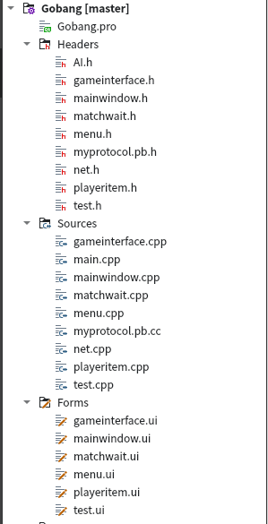
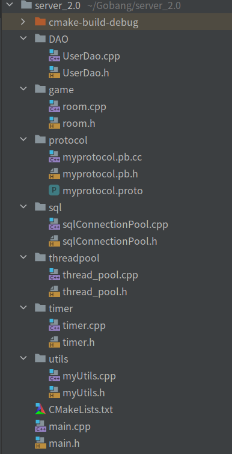
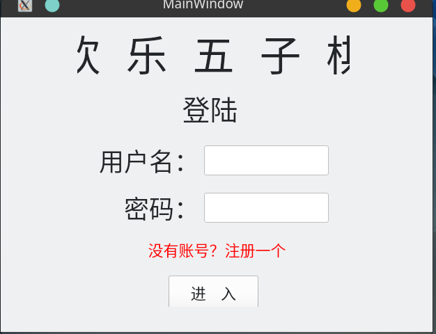
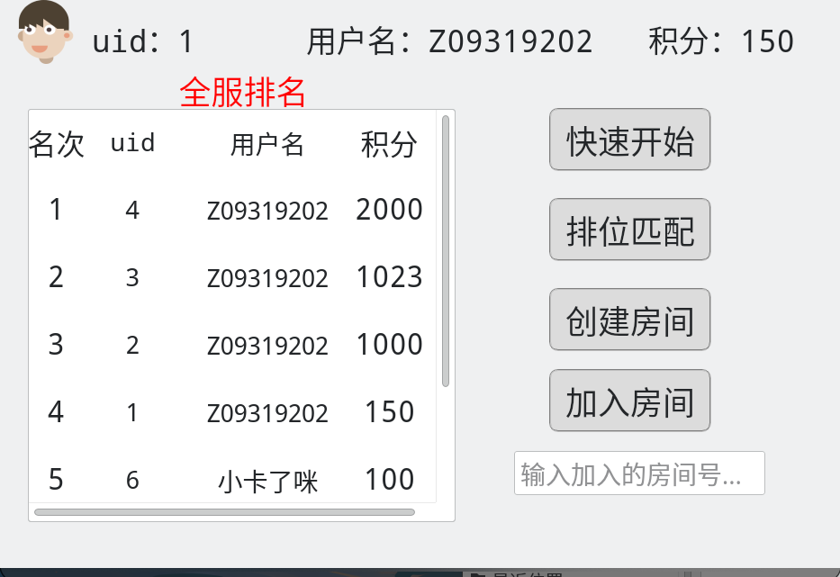
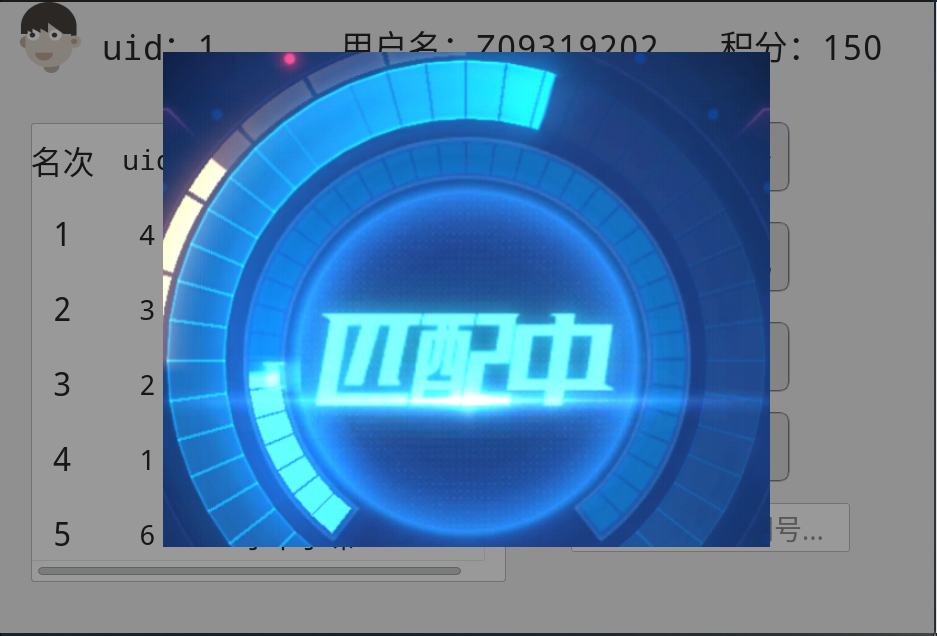
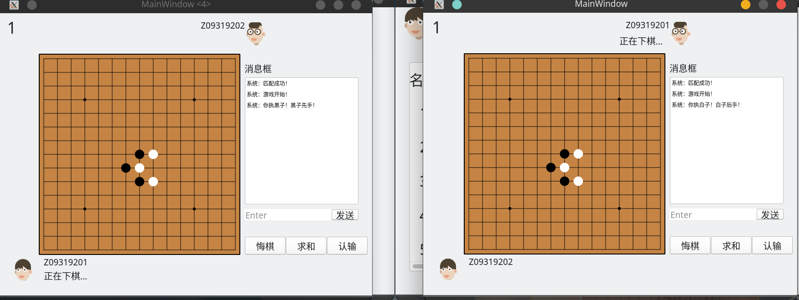

- [Gobang 联机五子棋（1.0）](#head1)
	- [ 项目简介](#head2)
		- [ 客户端](#head3)
		- [ 服务端](#head4)
	- [ 功能介绍](#head5)
	- [ TODO](#head6)
- [ 欢乐五子棋（Gobang2.0）](#head7)
	- [ 项目简介](#head8)
	- [ 客户端](#head9)
		- [ 项目整体：](#head10)
	- [ 服务端](#head11)
		- [优化 ？](#head12)
		- [ 项目整体：](#head13)
	- [ 界面展示](#head14)
	- [ TODO](#head15)
## Gobang 联机五子棋（1.0）

------

####  项目简介

初步巩固linux网络编程，重心偏向于服务端开发，客户端进行简单的快速开发提供一个交互界面。

#####  客户端

通过QT实现客户端的编写，提供友好的人机交互界面。

- QT的基础界面编程
- QT的画笔工具
- QT的基础socket编程

#####  服务端

Linux下使用c++编写的并发服务器，为客户端提供服务。

- 使用reactor事件处理模式
- 使用epoll多路IO复用技术,实现并发，采用 LT+LT epoll模式下的阻塞IO
- 通过线程池中工作线程处理IO事件和数据

####  功能介绍

- 人机对战功能
- 匹配对战，多个玩家同时匹配
- 创建房间
- 加入房间
- 棋局内能够悔棋，认输，求和和消息发送

####  TODO

- 使用Mysql进行数据存储服务，来完成用户信息的相关功能，如登陆，排名，对局记录等。
- 使用protobuf来设计通信协议，提高通信效率，避免TCP沾包。

##  欢乐五子棋（Gobang2.0）

------

####  项目简介

此项目诞生于**GoBang联机五子棋**，重写了服务端和客户端，使其功能更加完善。游戏功能具体改动如下：

- 删除人机对战功能

- 新增排位匹配，依据积分进行匹配，分5个阶段

- 新增可以连续和同一位玩家进行游戏（即不退出房间继续游戏）

- 新增对非活跃玩家踢出服务器

- 新增断线重连功能

- 新增全服排名

  

####  客户端

​	GoBang2.0客户端只进行界面展示，数据序列化和反序列化，即数据收发，不涉及游戏逻辑部分，

只进行简单的操作限制，确保客户端和服务器之间可以正确通信。

​	新增了几个界面，其他使用到的技术没有太大改变，可以参考GoBang1.0

#####  项目整体：

####  服务端

​	GoBang2.0服务端相比1.0更加复杂，具体如下：

- 通过**epoll I/O多路复用**（更改为使用LT+ET） 和 **线程池**的配合实现高效的**reactor事件处理模式**，来实现高并发。
- 使用**升序链表定时器**将非活跃玩家和断线连接超时的玩家踢出服务器。
- 使用**MySql**进行数据存储，并且使用**数据库连接池**对连接进行管理，减少连接创建销毁的开销，同时实现DAO层来操作数据库。
- 使用**protobuf**进行数据的序列化和反序列化，使用包头加body的结构妥善处理TCP沾包问题。（数据格式见myprotocol.proto）
- 游戏整体采用**状态同步**，服务器保存有游戏和玩家的状态，当状态发生改变时将整个棋盘同步给玩家，同时能够**断线重连**。

##### 优化 ？

利用**缓存思想**

- 慢写回，当玩家的数据发生改变时不会立即写入数据库而是先保存在服务器程序中，待玩家退出在写入数据库。
- 先读出，服务器程序在启动时会通过数据库查询先将排名数据加载到程序内存中此后不会在查询数据库，当排名发生改变时，直接改变程序内存中的排名。
- 棋盘同步，用8个64位int型整数来表示整个棋盘，一个int64代表棋盘两行，一个int64的每两位代表棋盘上的一个点，从而实现棋盘的压缩发送，减少带宽使用。

#####  项目整体：

####  界面展示

####  TODO

- 可以和webserver配合，通过http实现图像的上传和请求。
- 增加使用protobuf将玩家的对局信息进行序列化然后存储到数据库中，可以实现玩家对局记录的展示，甚至可以实现对局的回放效果。